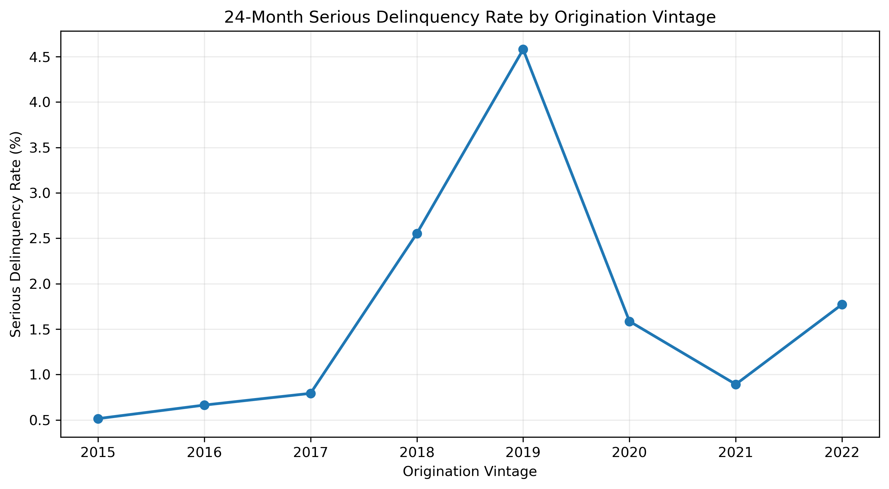
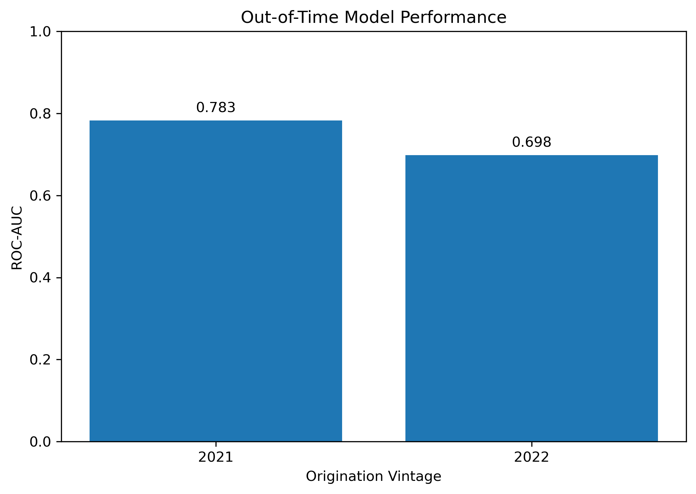
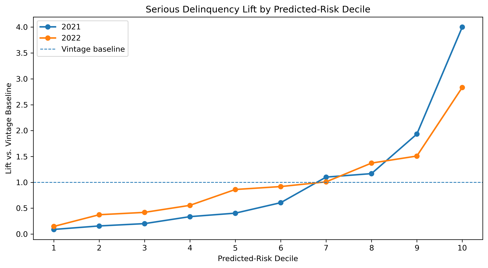

# Mortgage Risk Under Changing Economic Conditions

An analysis of how borrower characteristics and changing local economic conditions relate to serious mortgage delinquency, using Freddie Mac loan-level performance data from 2015–2022.

## Overview

Mortgage performance depends not only on borrower and loan characteristics at origination, but also on the economic environment borrowers experience after receiving a mortgage.

This project analyzes **397,423 mortgages** across the 2015–2022 Freddie Mac origination vintages and approximately **8.9 million loan-month observations**. Mortgage performance data are combined with state-level unemployment and home-price data to examine two related questions:

1. How are changing local economic conditions associated with serious mortgage delinquency?
2. How well can information available at origination identify mortgages with elevated future delinquency risk across changing economic environments?

The project combines longitudinal data engineering, discrete-time statistical modeling, out-of-time machine-learning validation, and distributed data analysis with PySpark and Databricks.

## Data

### Mortgage Data

Mortgage origination and monthly performance data come from the Freddie Mac Single-Family Loan-Level Dataset.

The analysis uses sample vintages from **2015 through 2022**, producing:

- **397,423 mortgages**
- Approximately **8.9 million loan-month observations**
- Borrower and loan characteristics including credit score, debt-to-income ratio, loan-to-value ratio, original balance, interest rate, occupancy status, property type, and loan purpose
- Monthly mortgage performance histories

Raw mortgage files are excluded from the repository.

### Economic Data

Mortgage performance is combined with:

- **Bureau of Labor Statistics:** state unemployment rates
- **Federal Housing Finance Agency:** state-level house price indexes
- **Freddie Mac PMMS:** historical mortgage rates

Economic conditions are aligned to each mortgage by geography and calendar month.

## Target Definition

The primary outcome is whether a mortgage reaches **90+ days delinquent within its first 24 months**.

Initial exploration showed that delinquency thresholds capture meaningfully different populations:

- 30+ days delinquent: **13.28%**
- 60+ days delinquent: **6.99%**
- 90+ days delinquent: **5.57%**

Only about **52.6%** of mortgages reaching 30+ days delinquent progressed to 60+, while approximately **79.7%** of mortgages reaching 60+ progressed to 90+.

For this reason, 90+ day delinquency was selected as the primary serious-delinquency outcome.



## Data Engineering and Methodology

### Calendar-Based Loan Age

During data validation, Freddie Mac's reported `loan_age` was found to occasionally reset later in a mortgage's history.

Using the reported field directly could therefore place later-life observations inside an apparent 24-month outcome window.

To prevent this, loan age was reconstructed from:

- first payment month
- monthly reporting period

This creates a consistent calendar-based measure of elapsed loan age.

### Outcome Validation

Additional target-construction checks included:

- examining non-numeric delinquency statuses
- validating terminal mortgage observations
- identifying early removals caused by Freddie Mac data-defect code 96
- excluding loans whose complete outcome window could not be observed because of an early data defect

The corrected pipeline produces **397,423 unique mortgages** across the eight analyzed vintages.

### Event-Aligned Economic Exposure

A second timing issue emerged when constructing economic exposures.

For mortgages that became seriously delinquent, using economic conditions observed after the first 90+ delinquency event would allow future information to influence the explanation of an event that had already occurred.

Economic histories were therefore truncated at each mortgage's first serious-delinquency event.

This removed approximately **59,740 post-event loan-month observations** while retaining the full mortgage population.

## Economic Conditions and Delinquency

A discrete-time logistic model was used to estimate the probability of first serious delinquency during each observed loan month.

The primary model uses a **three-month lag** for economic conditions and controls for borrower characteristics, loan characteristics, mortgage vintage, loan age, and geography.

The analysis found that:

- A **1 percentage-point increase in state unemployment** was associated with approximately **13.5% higher odds** of near-term serious delinquency, holding included controls constant.
- Stronger year-over-year home-price growth was associated with lower near-term delinquency odds.
- Credit score and debt-to-income ratio remained important baseline indicators of financial vulnerability.
- Interactions between DTI and unemployment, and between CLTV and home-price growth, provided little evidence that these characteristics substantially modified sensitivity to the corresponding economic changes.

State fixed-effect specifications produced similar macroeconomic associations, suggesting that the primary relationships were not explained solely by persistent differences between states.

Lag sensitivity analysis also showed that these relationships are dynamic rather than invariant across time horizons.

## Predictive Modeling

A separate predictive analysis asks whether characteristics known at mortgage origination can identify mortgages with elevated 24-month serious-delinquency risk.

Models were evaluated using a strict out-of-time design:

- **Training:** 2015–2019 vintages
- **Validation:** 2020 vintage
- **Locked test:** 2021–2022 vintages

Two primary models were compared:

- Logistic Regression
- Histogram Gradient Boosting

On the 2020 validation vintage:

| Model | ROC-AUC | PR-AUC |
|---|---:|---:|
| Logistic Regression | 0.770 | 0.056 |
| Gradient Boosting | 0.750 | 0.044 |

Logistic regression performed better on both validation metrics and was selected before evaluating the locked test set.

### Final Out-of-Time Performance

On the locked 2021–2022 test population:

- **ROC-AUC:** 0.733
- **PR-AUC:** 0.036
- **Serious-delinquency base rate:** 1.33%

Performance differed across economic vintages:

| Vintage | ROC-AUC | PR-AUC | Base Rate |
|---|---:|---:|---:|
| 2021 | 0.783 | 0.032 | 0.89% |
| 2022 | 0.698 | 0.042 | 1.77% |



This deterioration illustrates why temporal validation matters for risk models deployed across changing economic environments.

## Risk Stratification

Although predictive performance weakened in 2022, the model continued to separate mortgages into meaningfully different risk groups.

For the highest predicted-risk decile:

- **2021:** 3.57% serious-delinquency incidence, approximately **4.0×** the vintage baseline
- **2022:** 5.02% serious-delinquency incidence, approximately **2.83×** the vintage baseline



The results suggest that the model is more useful for **risk stratification and prioritization** than as a perfectly calibrated estimate of absolute delinquency probability.

## Databricks and PySpark

The processed multi-vintage mortgage dataset was also loaded into **Databricks** as a managed table to reproduce key portfolio analyses using **PySpark**.

The Databricks workflow:

- loaded the processed **397,423-row, 31-column** mortgage dataset into the Databricks workspace
- queried the data through the Spark DataFrame API
- reproduced mortgage counts and serious-delinquency rates across the 2015–2022 origination vintages
- performed distributed aggregation of serious-delinquency incidence across credit-score groups
- validated that the Databricks results were consistent with the locally processed modeling dataset

For example, the PySpark analysis showed a strong gradient in 24-month serious-delinquency incidence across credit-score groups, ranging from approximately **5.86% for mortgages with credit scores below 650** to approximately **0.43% for mortgages with scores of 800 or higher**.

This portion of the project demonstrates how the analytical workflow can be transferred from local Pandas-based development to a cloud-based Spark environment for larger-scale data processing and analysis.

## Business Implications

The analysis supports several practical risk-management conclusions:

**Monitor economic deterioration alongside borrower-level risk.**  
Origination characteristics establish baseline vulnerability, but local unemployment changes provide additional information about near-term mortgage stress.

**Use risk models for prioritization rather than automatic decisions.**  
Predicted risk groups could help prioritize portfolio monitoring, servicing resources, or proactive borrower-support programs without treating a model score as a lending decision.

**Continuously evaluate models across economic regimes.**  
The difference between 2021 and 2022 performance demonstrates that strong historical validation does not guarantee stable future performance.

**Monitor both discrimination and calibration.**  
A model can rank higher-risk mortgages effectively while still systematically under- or overestimating absolute probabilities.

## Responsible Use and Limitations

This project is intended as an analysis of **financial vulnerability and mortgage performance**, not as a system for determining who should receive credit.

Several limitations are important:

- The analysis is observational and does not establish that changing economic conditions cause individual borrowers to become delinquent.
- Geographic variables may proxy for socioeconomic circumstances not directly represented in the data.
- State-level economic measures do not capture each borrower's individual employment, income, or financial circumstances.
- Mortgage prepayment creates a competing-risk consideration because some loans leave observation before experiencing delinquency.
- Predictive relationships can shift across mortgage vintages and economic regimes.
- Standard errors in the loan-month analysis should be interpreted cautiously because observations are repeated within mortgages and economic conditions are shared across state-months.

The project therefore emphasizes associations, robustness, temporal validation, and portfolio-level risk analysis rather than automated lending approval or denial.

## Repository Structure

```text
Mortgage Risk Project/
├── data/
│   ├── processed/
│   ├── raw_macro/
│   └── raw_mortgage/
├── notebooks/
│   ├── 01_data_ingestion.ipynb
│   ├── 02_exploratory_analysis.ipynb
│   ├── 03_baseline_model.ipynb
│   ├── 04_multi_vintage_ingestion.ipynb
│   ├── 05_macroeconomic_data.ipynb
│   └── 06_databricks_analysis.ipynb
├── reports/
│   ├── out_of_time_performance.png
│   ├── risk_decile_lift.png
│   └── vintage_delinquency_rates.png
├── src/
│   ├── data_processing.py
│   └── make_figures.py
├── .gitignore
├── README.md
└── requirements.txt
```

## Tools and Technologies

**Data Analysis:** Python, Pandas, NumPy  
**Statistical Modeling:** statsmodels, scikit-learn  
**Machine Learning:** Logistic Regression, Histogram Gradient Boosting  
**Cloud & Distributed Computing:** Databricks, PySpark  
**Visualization:** Matplotlib, Seaborn  
**Version Control:** Git, GitHub